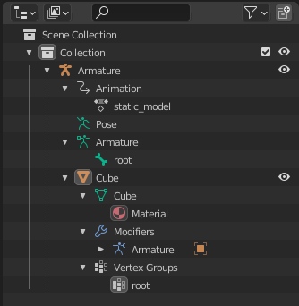
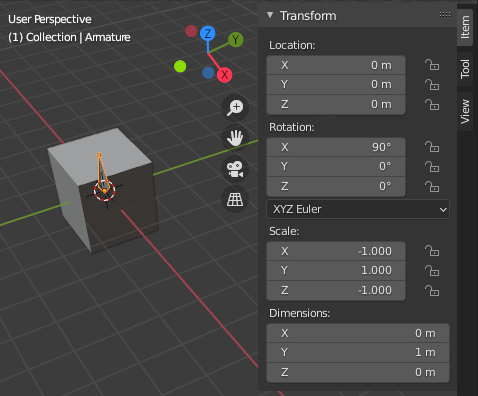
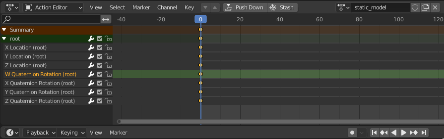
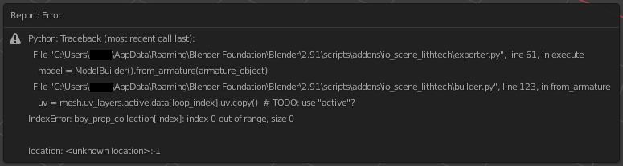
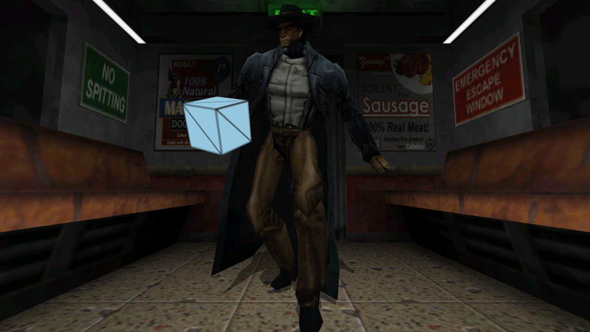

The absolute minimum your Blender scene must have to export successfully to ABCv6 is:
- One Armature
- One Mesh with an active UV Map
- One Action with at least 1 Keyframe

An example .blend can be found [here](./abc-v6-export-basics/minimal_abc-v6_no_anim.blend)

## Making a basic ABCv6 model
First make an armature, and in object mode set the X rotation to 90 degrees, and the X and Z scale to -1.

Next, make a mesh, and set its parent to the armature you just made. Then add an armature modifier for the same armature.

For every bone in your armature, the mesh *must* have a corresponding vertex group with the same name. Assign vertices you want to be affected by the bone here with a weight 1. *Never* assign multiple nodes to the same vertex, that is not supported by the format.

Finally create an action. Actions start at frame 0, and must have at least 1 keyframe. Actions named with a "d_" prefix will not be exported, it is expected these contain vertex animation keyframes.

Each bone must have the same amount of keyframes. They should be at the same times as the root node's **W Quaternion Rotation lane**. Only **location** and **rotation_quaternion** (other rotation types are not currently supported) lanes will be exported, scaling is not supported by the format.

## Exporting a basic ABCv6 model
Finally we can export our model. First we need to make sure the mesh is *triangulated* (ctrl + T).

Then we wind the triangles the correct way by *calculating the inside* (ctrl + shift + N).

Now, go to File -> Export -> Lithtech ABC, select the armature you want to export (should be done automatically), and choose the version: ABC v6 (Lithtech 1.0), and click export.

# Issues you may encounter
- If some of your bones try to converge at [0, 0, 0] after export, it means they have fewer keyframes than the root node.
- If you think your exported animation is missing some keyframes, check that you've set a rotation keyframe on your root node at the expected time.
- If the bounding boxes are too small or too large, make sure you aren't scaling any of your objects.
- If the export fails with an "active UV index 0 out of range" error, make sure you're not in mesh edit mode, select the mesh object, and click on the UV map you want to export, and try again.

## Final product
I named it BERETTA_PU.ABC, and put it in BLOOD2/MODELS/POWERUPS to make it appear in 3rd person and when dropped on the ground:

## Misc. Blender
- There's no way to export a frame command string from Blender yet, so you'll have to put it in ModelEdit after export to do this. Make sure to press enter after typing to confirm the string.
- If making a first person weapon model it may be helpful to create a camera object. I've found a Z position of 1m, and a rotation of X -90 degrees, and Z 180 degrees, with a 90 degree FOV to look fairly close to the game (in 16:9, with widescreen patches).