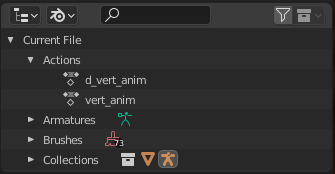
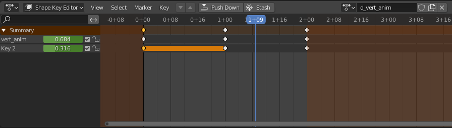

Vertex animations utilize the shape key feature of Blender.

An example .blend can be found [here](./abc-v6-export-basics/minimal_abc-v6_vert_anim.blend)

## Basics

Select the mesh (not the armature!), and go to the Dope Sheet's Shape Key Editor, create new action with the same name as the animation the vertex animation will be applied to, prefixed with "d_", eg. test_anim and d_test_anim

Create the shape keys, use mesh edit mode to manipulate them to whatever shape you like.

Now you can animate the values of each shape key in the Shape Key Editor.

## Misc. Tips
- Vertex animations will be skipped entirely if you have less than 2 shape keys